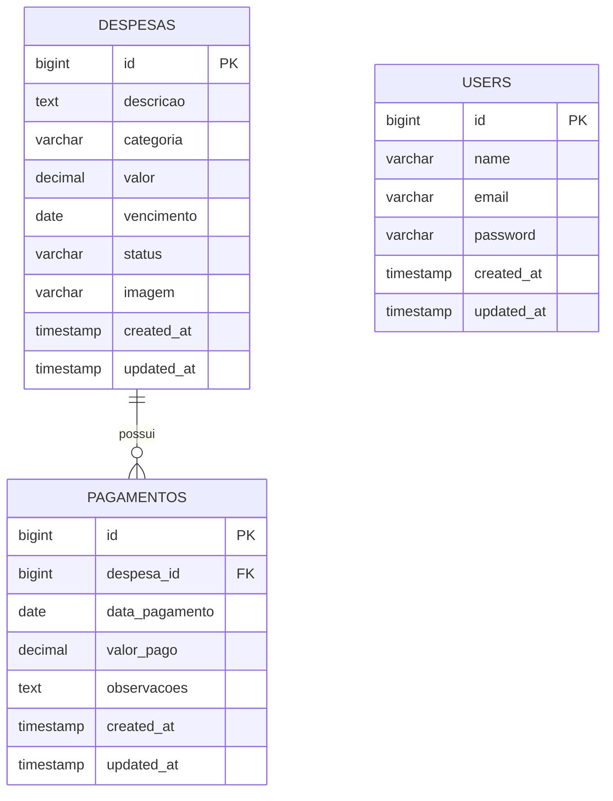

# Diagrama Entidade-Relacionamento

## Relacionamentos

- Uma despesa pode possuir zero ou vários pagamentos.
- Cada pagamento pertence obrigatoriamente a uma despesa.
- A exclusão de uma despesa exclui seus pagamentos por `ON DELETE CASCADE`.
- Usuários servem apenas para autenticação. Os registros financeiros são compartilhados.

